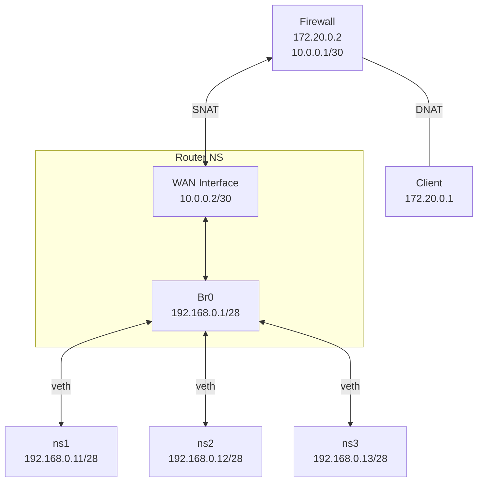

## Lab Objective

This project builds a complete virtual network environment using native Linux networking primitives, including network namespaces, virtual Ethernet pairs (veth), Linux bridges, routing tables and iptables.

The goal is not only to understand how container runtimes implement network isolation, but also to develop practical troubleshooting skills by observing packet flow, routing decisions, NAT translation and firewall filtering behavior at each stage of the network path.

The lab progressively evolves from simple namespace connectivity to a multi-tier topology containing dedicated router and firewall namespaces, closely resembling real-world enterprise and cloud networking environments.

## Steps & Implementation

1. Environment Isolation (Namespaces)
   **Objective:** Achieve resource isolation by creating independent namespaces.
2. Point-to-Point Communication (veth pairs)
   **Objective**: Establish connectivity between isolated network namespaces.
   **Key Actions:**
   Implemented `veth pairs` to bridge two isolated network namespaces.
   Configured IP addresses and interface states (`up`) to enable direct traffic between the `client-ns` and `server-ns`.
3. Network Topology Scaling (Bridge)
   **Objective:** Manage multiple namespaces efficiently using a virtual bridge.
   **Key Actions:**
   Created a virtual bridge (`br0`) to connect multiple namespaces.
   Configured routing and SNAT (using `iptables`) to allow namespaces to communicate with the host and the external internet.

4. DNAT & Firewall filtering
   Isolate bridge and host, use DNAT to port-forwarding request from client to ns1/2/3. Block 10 and 196 inner IP access from client.

5. TODO: Update Firewall filter from iptables to nftables
6. TODO: Fault injection
