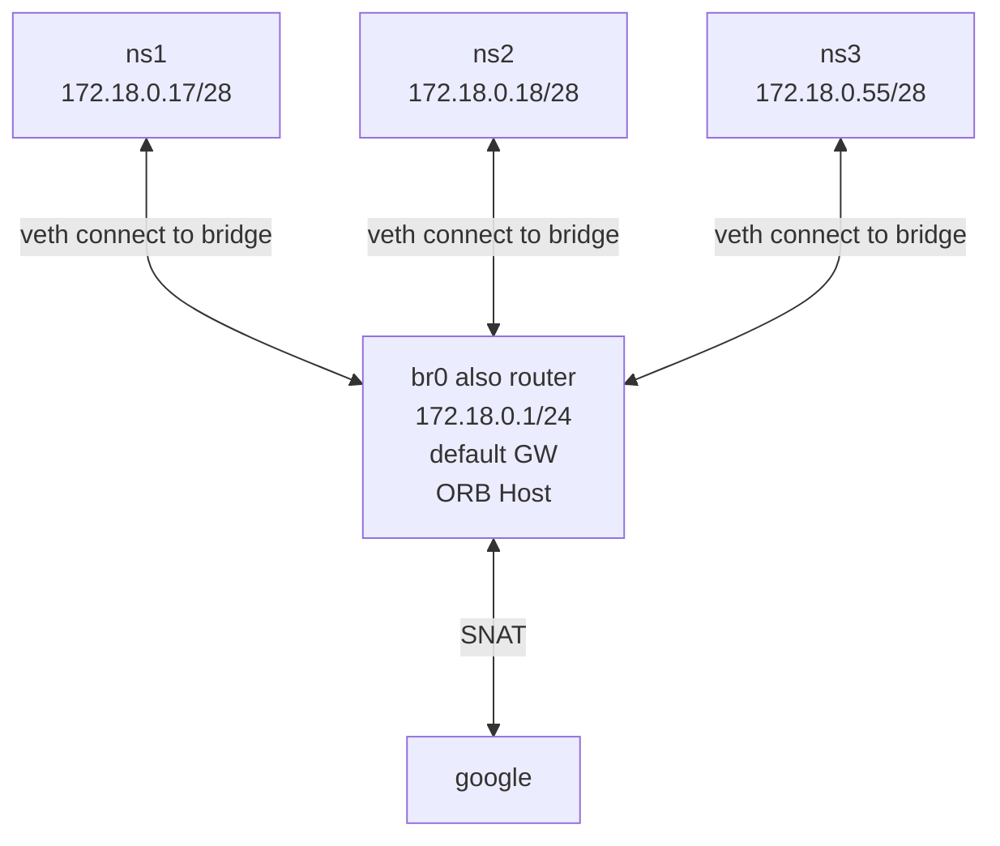
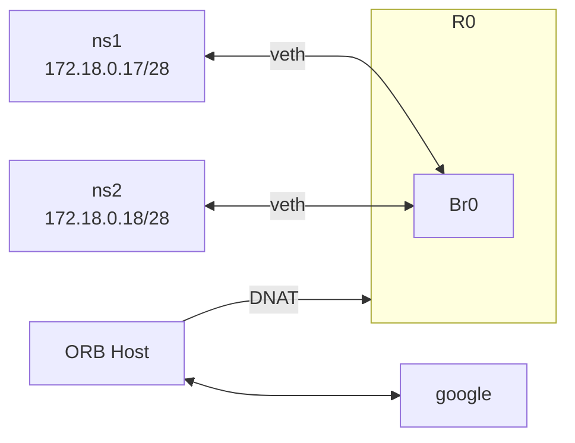

## Lab Objective

This project demystifies container networking by manually constructing isolated environments from the ground up using native Linux kernel **Namespaces**.

By rebuilding these network stacks, this lab serves as a hands-on verification of how container runtimes (like Docker/Kubernetes) abstract OS-level network primitives. It provides a clear view into the underlying mechanisms that govern network isolation, connectivity, and routing in modern containerized environments.

## Steps & Implementation

1. Environment Isolation (Namespaces)
   **Objective:** Achieve resource isolation by creating independent namespaces.
2. Point-to-Point Communication (veth pairs)
   **Objective**: Establish connectivity between isolated network namespaces.
   **Key Actions:**
   Implemented `veth pairs` to bridge two isolated network namespaces.
   Configured IP addresses and interface states (`up`) to enable direct traffic between the `client-ns` and `server-ns`.
3. Network Topology Scaling (Bridge)
   **Objective:** Manage multiple namespaces efficiently using a virtual bridge.
   **Key Actions:**
   Created a virtual bridge (`br0`) to connect multiple namespaces.
   Configured routing and SNAT (using `iptables`) to allow namespaces to communicate with the host and the external internet.

4. DNAT 
	Isolate bridge and host, use DNAT to send request from host to ns1/2/3
	`[172.18.0.1/24   default GW]`

4. Firewall filtering
	 

